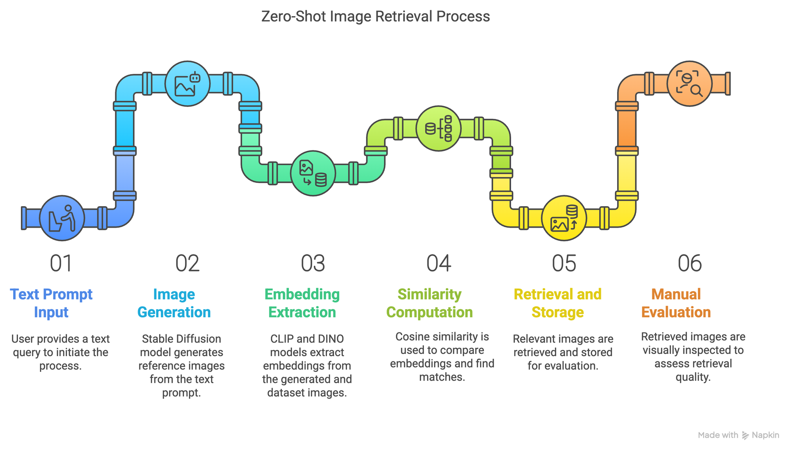
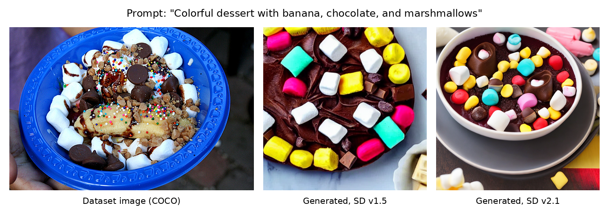

# Zero-Shot Image Retrieval Using Vision-Language Models

Retrieve relevant images from an **unlabeled** image collection using only a text query, with no training. Instead of matching text to images directly, the text prompt is first turned into a *reference image* with Stable Diffusion. That image is then compared with every image in the collection using CLIP and DINOv2 embeddings and cosine similarity.

This was a course project for EECE 570 at UBC. Full details are in the [project report](docs/EECE_570_Project_Report.pdf).

## How it works



```
text prompt ──► Stable Diffusion (v1.5, v2.1) ──► reference image
                                                        │
                                       CLIP / DINOv2 embeddings
                                                        │
 30 COCO images ──► CLIP / DINOv2 embeddings ──► cosine similarity ──► top-2 retrieved images
```

1. **Prompt → image.** Each of 20 hand-written prompts is turned into an image with Stable Diffusion v1.5 and with v2.1.
2. **Embeddings.** Generated images and the dataset images are embedded with CLIP (ViT-B/32) and with DINOv2 (`facebook/dinov2-base`).
3. **Retrieval.** For each prompt and each of the four combinations (CLIP or DINOv2 × SD v1.5 or v2.1), the 2 dataset images with the highest cosine similarity are retrieved.
4. **Evaluation.** The retrieved images were judged manually, by visual inspection, against the prompt and the generated image. Each result was labelled *Related*, *Somehow related* or *Not related*.

Example: a dataset image next to the images Stable Diffusion generated from the prompt written for it.



### Data

- **Retrieval set:** 30 images from the COCO 2017 validation set, each containing 2–3 distinct object categories (see `scripts/dataset_creation.py`).
- **Prompts:** 20 prompts in `data/prompts.txt`. Ten are detailed and close to a single dataset image (e.g. "Woman sitting near Eiffel Tower with pigeons"); ten are general and could match several images (e.g. "Moments of motion and action").

## Results

Manual labels for every retrieved image are in [`results/Results.xlsx`](results/Results.xlsx). Each prompt has 4 combinations × 2 retrieved images = 8 judgements, so the tables below are based on 160 judgements in total.

**By embedding model, SD version and prompt type** (top-2 results combined; each row is 80 judgements):

| | Related | Somehow related | Not related |
|---|---|---|---|
| CLIP | 0.700 | 0.075 | 0.225 |
| DINOv2 | 0.650 | 0.100 | 0.250 |
| SD v1.5 | 0.6625 | 0.0875 | 0.250 |
| SD v2.1 | 0.6875 | 0.0875 | 0.225 |
| Detailed prompts | 0.625 | 0.100 | 0.275 |
| General prompts | 0.725 | 0.075 | 0.200 |

**By combination, share of retrieved images labelled *Related*** (20 prompts per cell):

| Embedding + SD version | Top-1 result | Top-2 result | Both |
|---|---|---|---|
| CLIP + SD v1.5 | 0.85 | 0.60 | 0.725 |
| CLIP + SD v2.1 | 0.85 | 0.50 | 0.675 |
| DINOv2 + SD v1.5 | 0.75 | 0.45 | 0.600 |
| DINOv2 + SD v2.1 | 0.90 | 0.50 | 0.700 |

**What to take from this**

- The best match (top-1) was judged related for 75–90% of prompts, so the approach clearly works. The second match is much weaker (45–60%), which is expected when the collection has only 30 images and many prompts describe a single one.
- CLIP was slightly better than DINOv2 overall, and SD v2.1 slightly better than v1.5, but the differences are small. DINOv2 depended more on the SD version (0.60 vs 0.70) than CLIP did.
- General prompts worked better than detailed ones, so broad semantic cues were handled more robustly than very specific descriptions.
- **These are small-sample results.** With 20 prompts, one prompt changes a top-1 number by 5 percentage points, and the labels come from manual judgement without a fixed rubric. The numbers show trends, not statistically reliable differences.

## Repository structure

```
├── data/
│   ├── images/                  # the 30 COCO images (reference set)
│   └── prompts.txt              # the 20 text prompts
├── generated_images/
│   ├── v1-5/                    # images from Stable Diffusion v1.5
│   └── v2-1/                    # images from Stable Diffusion v2.1
├── embeddings/                  # pre-computed CLIP and DINOv2 embeddings (.pt)
├── notebooks/
│   └── text_to_image.ipynb      # generates the images (needs a GPU)
├── scripts/
│   ├── dataset_creation.py                       # builds the COCO subset
│   ├── dataset_embedding_extraction.py           # embeddings of the COCO images
│   ├── generated_images_embedding_extraction.py  # embeddings of the generated images
│   ├── retrieve_similar_images.py                # cosine-similarity retrieval
│   └── utils.py                                  # shared helper functions
├── results/
│   ├── Results.xlsx                       # manual evaluation of the retrieved images
│   └── retrieved_similar_images.json      # top-2 matches and similarity scores
├── docs/
│   ├── figures/                 # images used in this README
│   └── ...                      # project proposal and report (PDF)
├── requirements.txt
└── LICENSE
```

## Setup

All commands are run from the repository root.

```bash
python -m venv venv
source venv/bin/activate
pip install -r requirements.txt
```

`git` must be installed, because CLIP is installed from GitHub. Developed with Python 3.11.

## Usage

**Quick start: run the retrieval on the included data.** The repository already contains the images and embeddings, so this works right after setup:

```bash
python scripts/retrieve_similar_images.py
```

This writes `results/retrieved_similar_images.json`: for every prompt, the top-2 dataset images and their cosine similarity for each of the four combinations.

**Rebuild the whole pipeline** (optional):

1. **Create the dataset.** Downloads the COCO validation annotations (about 240 MB, only needed once) and the 30 selected images:
   ```bash
   python scripts/dataset_creation.py
   ```
2. **Generate the images.** Open `notebooks/text_to_image.ipynb` in Jupyter or Google Colab with a GPU runtime. It reads `data/prompts.txt` and saves to `generated_images/v1-5/` and `generated_images/v2-1/`.
3. **Extract the embeddings:**
   ```bash
   python scripts/dataset_embedding_extraction.py
   python scripts/generated_images_embedding_extraction.py
   ```
4. **Retrieve similar images:**
   ```bash
   python scripts/retrieve_similar_images.py
   ```

Image generation is not repeatable, so regenerating the images (step 2) gives different images from the ones in this repository. The committed images, embeddings and `Results.xlsx` belong together; if you regenerate, the manual evaluation no longer matches.

## Limitations

- Small evaluation: 30 dataset images and 20 prompts.
- Manual, subjective evaluation with no automatic metric.
- Limited GPU resources meant only two Stable Diffusion versions and two embedding models were compared.

## Data and model credits

- **Images:** [COCO](https://cocodataset.org/) (Lin et al., 2014). The images come from Flickr and keep their original licences; see the [COCO terms of use](https://cocodataset.org/#termsofuse).
- **CLIP** (Radford et al., 2021), model ViT-B/32 from [openai/CLIP](https://github.com/openai/CLIP).
- **DINOv2**, model [`facebook/dinov2-base`](https://huggingface.co/facebook/dinov2-base). The report cites the original DINO paper (Caron et al., 2021).
- **Stable Diffusion** v1.5 and v2.1 (Rombach et al., 2022). The original Hugging Face repositories of both models have been taken down or deprecated, so the notebook loads community mirrors (`sd-legacy/stable-diffusion-v1-5` and `sd2-community/stable-diffusion-2-1`), which are not affiliated with the original publishers. The images in this repository were generated before that change. The models have their own licences (CreativeML Open RAIL-M for v1.5 and Open RAIL++-M for v2.1); check the model pages before reusing generated images.

## License

The code in this repository is released under the MIT License (see `LICENSE`). Datasets and models keep their own licences, as described above.